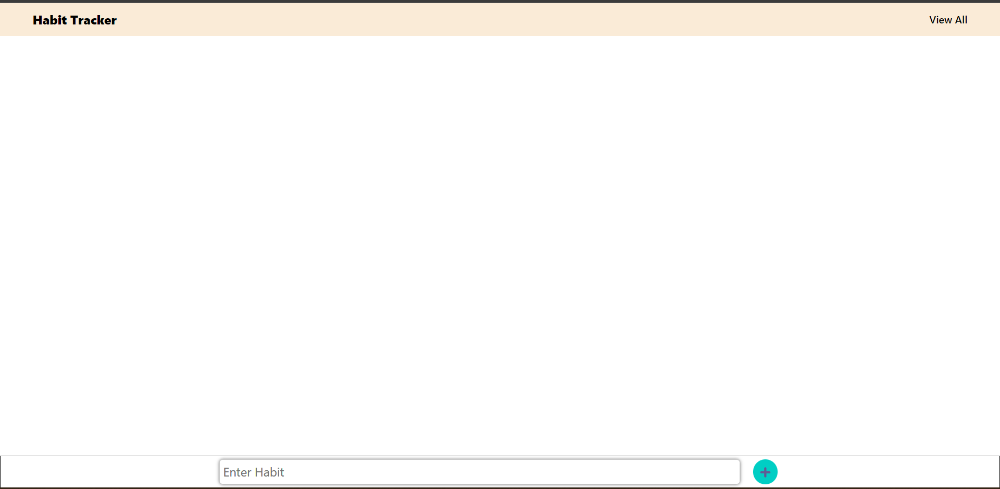
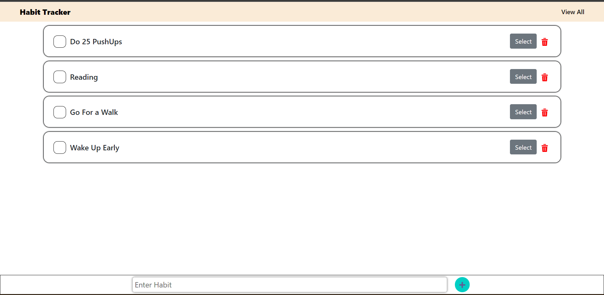
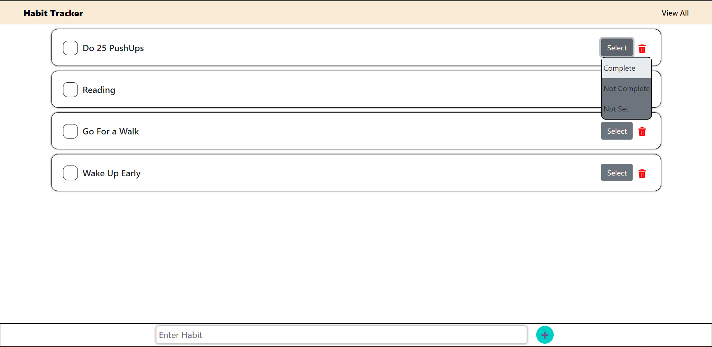
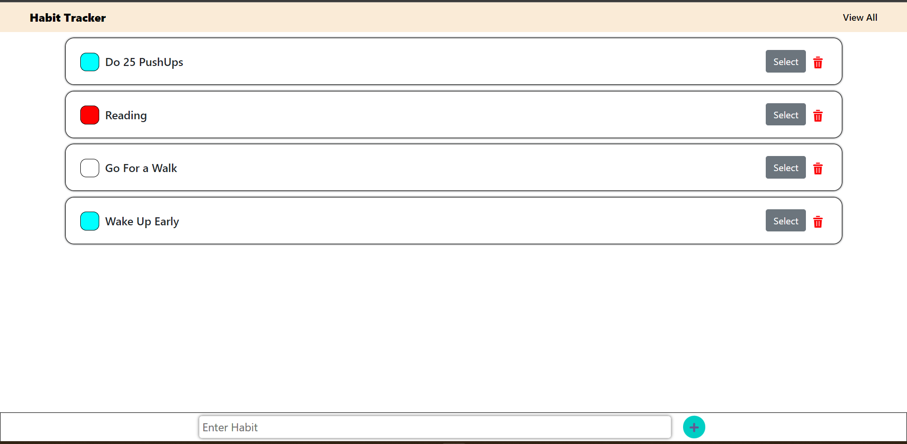
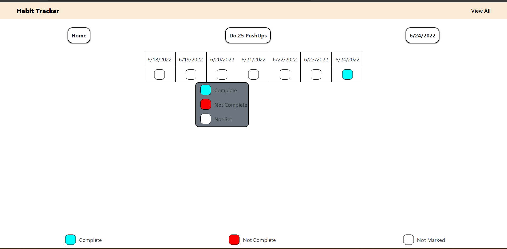
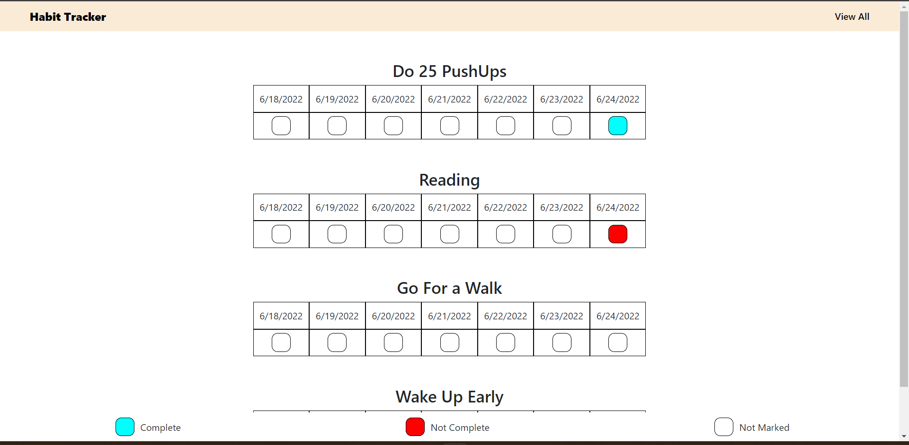

## Hosted Link -- https://habit-tracker-b8092.firebaseapp.com/

# Habit tracker React app

### Description

`a habit tracker app, where we can define habits and track them.`

> Show today where user can mark todays habit

> show the previous 6 days and the status of that habit for each day

> A user can toggle between the three (above mentioned) statuses of a habit i.e. I can change today’s status as done, not done or none anytime.

> Also it should be able to change any of the previous days status i.e. it can change the status of a habit for yesterday, day before yesterday or any previous 6 days as well

## React Album

## Folder Structure

```

habit-tracker-app
├─ .gitignore
├─ package-lock.json
├─ package.json
├─ public
│ ├─ favicon.ico
│ ├─ index.html
│ ├─ logo192.png
│ ├─ logo512.png
│ ├─ manifest.json
│ └─ robots.txt
├─ README.md
└─ src
├─ actioin
│ └─ index.js
├─ component
│ ├─ App.js
│ ├─ CaredDetail.js
│ ├─ HabitCard.js
│ ├─ HabitTrackerApp.js
│ ├─ NavBar.js
│ ├─ NewHabitFooter.js
│ ├─ ViewAllHabit.js
│ ├─ WeaklyMarkDetail.js
│ ├─ WeeklyHabit.js
│ ├─ WeeklyHabitGroup.js
│ └─ WeeklyHead.js
├─ css
│ ├─ habitCard.css
│ ├─ index.css
│ ├─ navBar.css
│ ├─ newHabitFooter.css
│ ├─ weeklyHead.css
│ └─ weeklyMarkDetail.css
├─ index.js
└─ reducer
└─ index.js

```

## Some ScreenShots of Project







